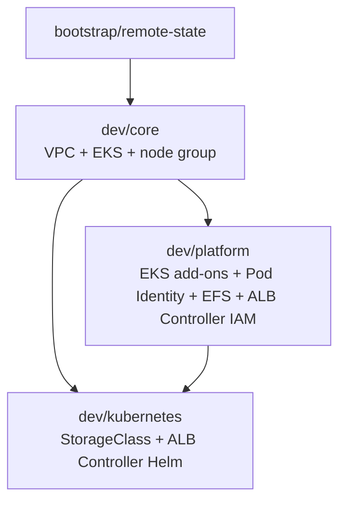

# Amazon EKS Platform Terraform

This repository builds an enterprise-style Amazon EKS platform in layered Terraform roots. The split keeps AWS infrastructure, platform AWS integrations, and Kubernetes runtime resources in separate state files so a fresh rebuild can plan cleanly.

## Current Scope

Implemented phases:

- Remote state bootstrap
- VPC networking
- EKS cluster and managed node group
- EKS access entries
- Core EKS managed add-ons
- EKS Pod Identity
- Dedicated VPC CNI IAM role
- Amazon EFS
- EFS CSI driver
- Kubernetes EFS StorageClass
- AWS Load Balancer Controller
- Helm releases

Not yet implemented:

- Argo CD
- Route 53
- ACM
- Production infrastructure

## Directory Structure

```text
aws-EKS-Cluster-terraform-code/
├── bootstrap/
│   └── remote-state/
├── modules/
│   ├── networking/
│   ├── eks/
│   ├── eks-addons/
│   ├── efs/
│   ├── alb-controller/
│   └── argocd/
├── environments/
│   ├── dev/
│   │   ├── core/
│   │   ├── platform/
│   │   └── kubernetes/
│   └── prod/
│       └── README.md
├── helm-values/
└── README.md
```

## State Ownership

| Root | State key | Owns |
| --- | --- | --- |
| `bootstrap/remote-state` | local/bootstrap state | S3 state bucket bootstrap only |
| `environments/dev/core` | `eks-platform/dev/core.tfstate` | VPC, subnets, routes, NAT, EKS cluster, access entries, node IAM role, managed node group, temporary node-role CNI bootstrap attachment |
| `environments/dev/platform` | `eks-platform/dev/platform.tfstate` | EKS managed add-ons, VPC CNI Pod Identity role/association, EFS, EFS CSI IAM role/association, EFS CSI add-on, AWS Load Balancer Controller IAM role/policy/Pod Identity association |
| `environments/dev/kubernetes` | `eks-platform/dev/kubernetes.tfstate` | Kubernetes runtime resources, including the EFS StorageClass, AWS Load Balancer Controller ServiceAccount, and AWS Load Balancer Controller Helm release |

No resource is intentionally owned by more than one Terraform root.

## Backend

Development roots use the S3 state bucket:

```text
eks-platform-terraform-state-945788750616
```

Region:

```text
us-east-1
```

All development backends use:

```hcl
use_lockfile = true
encrypt      = true
```

No DynamoDB locking table is used.

## Cross-State Flow



`dev/core` has no dependency on platform or Kubernetes state. `dev/platform` consumes only core outputs. `dev/kubernetes` consumes core outputs for cluster identity and platform outputs for AWS-side integrations such as the EFS filesystem ID and AWS Load Balancer Controller Pod Identity resources.

## Build Workflow

1. Bootstrap remote state, normally once:

```bash
cd bootstrap/remote-state
terraform init
terraform validate
terraform plan
terraform apply
```

Do not recreate or destroy the state bucket during routine development.

2. Build the core layer with temporary CNI bootstrap permission enabled:

```bash
cd environments/dev/core
terraform init -reconfigure
terraform validate
terraform plan -out=tfplan-core-rebuild
```

For a fresh cluster, keep:

```hcl
attach_cni_policy_to_node_role = true
```

3. After applying core, validate nodes:

```bash
aws eks update-kubeconfig --name eks-platform-dev --region us-east-1
kubectl get nodes -o wide
```

Both managed nodes must be `Ready`.

4. Build the platform layer:

```bash
cd environments/dev/platform
terraform init -reconfigure
terraform validate
terraform plan -out=tfplan-platform
```

5. After applying platform, validate add-ons and Pod Identity:

```bash
kubectl get pods -n kube-system
aws eks list-addons --cluster-name eks-platform-dev --region us-east-1
aws eks list-pod-identity-associations --cluster-name eks-platform-dev --region us-east-1
```

All required add-ons must be `ACTIVE` and healthy.

6. Return to core and disable the temporary node-role CNI policy:

```hcl
attach_cni_policy_to_node_role = false
```

Then plan:

```bash
cd environments/dev/core
terraform plan -out=tfplan-cni-cleanup
```

Expected result: only the temporary node IAM policy attachment is destroyed.

7. After applying the saved cleanup plan, validate nodes and system pods again:

```bash
kubectl get nodes
kubectl get pods -n kube-system
```

8. Build the Kubernetes runtime layer:

```bash
cd environments/dev/kubernetes
terraform init -reconfigure
terraform validate
terraform plan -out=tfplan-kubernetes
```

The AWS Load Balancer Controller Helm release is in this layer because it creates Kubernetes resources. Its IAM policy, IAM role, and Pod Identity association are created first by `dev/platform`.

9. After applying Kubernetes resources, validate:

```bash
kubectl get storageclass
kubectl get serviceaccount aws-load-balancer-controller -n kube-system
helm list -n kube-system
```

Expected StorageClass:

```text
efs-sc
```

Expected AWS Load Balancer Controller release:

```text
aws-load-balancer-controller
```

10. Run the EFS PVC writer/reader persistence test.

11. Run `terraform plan` in all three dev roots:

```text
environments/dev/core
environments/dev/platform
environments/dev/kubernetes
```

Expected result in each root:

```text
No changes.
```

## Destroy Workflow

Destroy development infrastructure in this order:

1. `environments/dev/kubernetes`
2. `environments/dev/platform`
3. `environments/dev/core`

Keep:

```text
bootstrap/remote-state
```

Do not destroy the state bucket during normal development teardown.

## Temporary VPC CNI Bootstrap Lifecycle

Fresh EKS managed nodes need the VPC CNI to function before Pod Identity is installed. During a fresh `dev/core` build:

```hcl
attach_cni_policy_to_node_role = true
```

This attaches `AmazonEKS_CNI_Policy` to the EC2 node IAM role as a bootstrap safety net.

After `dev/platform` creates:

- `eks-pod-identity-agent`
- dedicated `eks-platform-dev-vpc-cni-role`
- Pod Identity association for `kube-system/aws-node`
- managed `vpc-cni` add-on

return to `dev/core` and set:

```hcl
attach_cni_policy_to_node_role = false
```

The cleanup plan should destroy only:

```text
module.eks.aws_iam_role_policy_attachment.node_cni_temporary[0]
```

## Add-On Version Pinning

The platform currently preserves dynamic EKS add-on discovery when version variables are `null`.

Before the next infrastructure rebuild, resolve compatible EKS `1.35` versions and pin them in `environments/dev/platform/terraform.tfvars`:

```hcl
vpc_cni_addon_version            = "<approved-version>"
coredns_addon_version            = "<approved-version>"
kube_proxy_addon_version         = "<approved-version>"
pod_identity_agent_addon_version = "<approved-version>"
efs_csi_addon_version            = "<approved-version>"
```

Do not silently upgrade add-ons as part of unrelated changes.

## Design Notes

- `dev/core` and `dev/platform` are AWS-provider-only roots.
- `dev/kubernetes` is the only root that configures the Kubernetes and Helm providers.
- EFS mount targets use stable Availability Zone keys from `private_subnet_ids_by_az`, not unknown subnet IDs as `for_each` keys.
- Broad module-level dependencies are avoided except `module.eks depends_on = [module.networking]`, which intentionally ensures NAT/private routing are complete before private nodes bootstrap.
- AWS Load Balancer Controller uses EKS Pod Identity, not IRSA. The ServiceAccount has no `eks.amazonaws.com/role-arn` annotation.
- The controller webhook listens on TCP 9443. No extra Terraform-managed security-group rule is currently needed because the EKS-created cluster security group is attached to the managed node group and includes its default self-referencing inbound rule.
- Do not use `terraform -target`, sleeps, `null_resource`, or manual console changes for normal lifecycle ordering.
