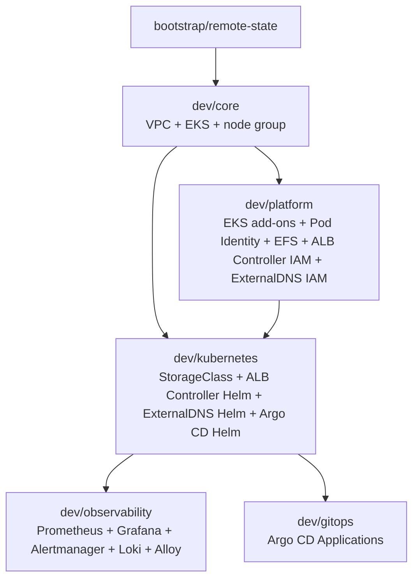

# Amazon EKS Platform Terraform

This repository builds an enterprise-style Amazon EKS platform in layered Terraform roots. The split keeps AWS infrastructure, platform AWS integrations, and Kubernetes runtime resources in separate state files so a fresh rebuild can plan cleanly.

## Current Scope

Implemented phases:

- Remote state bootstrap
- VPC networking
- EKS cluster and managed node group
- EKS access entries
- Core EKS managed add-ons
- EKS Pod Identity
- Dedicated VPC CNI IAM role
- Amazon EFS
- EFS CSI driver
- Kubernetes EFS StorageClass
- AWS Load Balancer Controller
- Argo CD
- nginx GitOps demo Application
- ExternalDNS
- Helm releases
- Observability scaffolding

Not yet implemented:

- Production Route 53 architecture
- ACM certificate provisioning
- nginx demo HTTPS Ingress hostname
- Persistent monitoring storage
- Production infrastructure

## Directory Structure

```text
aws-EKS-Cluster-terraform-code/
├── bootstrap/
│   └── remote-state/
├── modules/
│   ├── networking/
│   ├── eks/
│   ├── eks-addons/
│   ├── efs/
│   ├── alb-controller/
│   ├── external-dns/
│   └── argocd/
├── environments/
│   ├── dev/
│   │   ├── core/
│   │   ├── platform/
│   │   ├── kubernetes/
│   │   ├── observability/
│   │   └── gitops/
│   └── prod/
│       └── README.md
├── gitops/
│   └── apps/
│       └── nginx-demo/
├── helm-values/
└── README.md
```

## State Ownership

| Root | State key | Owns |
| --- | --- | --- |
| `bootstrap/remote-state` | local/bootstrap state | S3 state bucket bootstrap only |
| `environments/dev/core` | `eks-platform/dev/core.tfstate` | VPC, subnets, routes, NAT, EKS cluster, access entries, node IAM role, managed node group, temporary node-role CNI bootstrap attachment |
| `environments/dev/platform` | `eks-platform/dev/platform.tfstate` | EKS managed add-ons, VPC CNI Pod Identity role/association, EFS, EFS CSI IAM role/association, EFS CSI add-on, AWS Load Balancer Controller IAM role/policy/Pod Identity association, ExternalDNS IAM role/policy/Pod Identity association |
| `environments/dev/kubernetes` | `eks-platform/dev/kubernetes.tfstate` | Kubernetes runtime/bootstrap resources: EFS StorageClass, AWS Load Balancer Controller ServiceAccount and Helm release, ExternalDNS namespace/ServiceAccount/Helm release, Argo CD namespace and Helm release |
| `environments/dev/observability` | `eks-platform/dev/observability.tfstate` | Observability namespace and Helm releases for kube-prometheus-stack, Loki, and Grafana Alloy |
| `environments/dev/gitops` | `eks-platform/dev/gitops.tfstate` | Argo CD Application declarations, currently `nginx-demo` |

No resource is intentionally owned by more than one Terraform root.

## Backend

Development roots use the S3 state bucket created by `bootstrap/remote-state`:

```text
eks-platform-terraform-state-945788750616
```

Region:

```text
us-east-1
```

All development backends use:

```hcl
use_lockfile = true
encrypt      = true
```

No DynamoDB locking table is used.

## Cross-State Flow



`dev/core` has no dependency on platform, Kubernetes, observability, or GitOps state. `dev/platform` consumes only core outputs. `dev/kubernetes` consumes core outputs for cluster identity and platform outputs for AWS-side integrations such as the EFS filesystem ID and AWS Load Balancer Controller Pod Identity resources. `dev/observability` consumes core outputs to connect to the EKS API after Kubernetes bootstrap resources are ready. `dev/gitops` runs after `dev/kubernetes` so Argo CD CRDs exist before Terraform plans Argo CD `Application` resources.

## Build Workflow

1. Bootstrap remote state, normally once:

```bash
cd bootstrap/remote-state
terraform init
terraform validate
terraform plan
terraform apply
```

Do not recreate or destroy the state bucket during routine development.

2. Build the core layer with temporary CNI bootstrap permission enabled:

```bash
cd environments/dev/core
terraform init -reconfigure
terraform validate
terraform plan -out=tfplan-core-rebuild
```

For a fresh cluster, keep:

```hcl
attach_cni_policy_to_node_role = true
```

3. After applying core, validate nodes:

```bash
aws eks update-kubeconfig --name eks-platform-dev --region us-east-1
kubectl get nodes -o wide
```

Both managed nodes must be `Ready`.

4. Build the platform layer:

```bash
cd environments/dev/platform
terraform init -reconfigure
terraform validate
terraform plan -out=tfplan-platform
```

5. After applying platform, validate add-ons and Pod Identity:

```bash
kubectl get pods -n kube-system
aws eks list-addons --cluster-name eks-platform-dev --region us-east-1
aws eks list-pod-identity-associations --cluster-name eks-platform-dev --region us-east-1
```

All required add-ons must be `ACTIVE` and healthy.

6. Return to core and disable the temporary node-role CNI policy:

```hcl
attach_cni_policy_to_node_role = false
```

Then plan:

```bash
cd environments/dev/core
terraform plan -out=tfplan-cni-cleanup
```

Expected result: only the temporary node IAM policy attachment is destroyed.

7. After applying the saved cleanup plan, validate nodes and system pods again:

```bash
kubectl get nodes
kubectl get pods -n kube-system
```

8. Build the Kubernetes runtime/bootstrap layer:

```bash
cd environments/dev/kubernetes
terraform init -reconfigure
terraform validate
terraform plan -out=tfplan-kubernetes
```

The AWS Load Balancer Controller Helm release is in this layer because it creates Kubernetes resources. Its IAM policy, IAM role, and Pod Identity association are created first by `dev/platform`.
The Argo CD Helm release is also in this layer so its CRDs are established before GitOps Application objects are planned in the next layer.

9. After applying Kubernetes resources, validate:

```bash
kubectl get storageclass
kubectl get serviceaccount aws-load-balancer-controller -n kube-system
kubectl get deployment,pods -n external-dns
helm list -n kube-system
helm list -n external-dns
helm list -n argocd
```

Expected StorageClass:

```text
efs-sc
```

Expected AWS Load Balancer Controller release:

```text
aws-load-balancer-controller
```

Expected Argo CD release:

```text
argocd
```

Expected ExternalDNS release:

```text
external-dns
```

10. Build the observability layer:

```bash
cd environments/dev/observability
terraform init -reconfigure
terraform validate
terraform plan -out=tfplan-observability
```

Phase 9A creates the layer and chart scaffolding only. Persistent monitoring storage is intentionally deferred to Phase 9B.

11. Build the GitOps Application layer after the nginx manifests are committed and pushed:

```bash
cd environments/dev/gitops
terraform init -reconfigure
terraform validate
terraform plan -out=tfplan-gitops
```

This layer creates Argo CD `Application` resources only. The Kubernetes workloads under `gitops/apps/` are reconciled by Argo CD from Git and are not Terraform-managed.

12. Run the EFS PVC writer/reader persistence test.

13. Run `terraform plan` in all five dev roots:

```text
environments/dev/core
environments/dev/platform
environments/dev/kubernetes
environments/dev/observability
environments/dev/gitops
```

Expected result in each root:

```text
No changes.
```

## Destroy Workflow

Destroy development infrastructure in this order:

1. `environments/dev/gitops`
2. `environments/dev/observability`
3. `environments/dev/kubernetes`
4. `environments/dev/platform`
5. `environments/dev/core`

Keep:

```text
bootstrap/remote-state
```

Do not destroy the state bucket during normal development teardown.

## Temporary VPC CNI Bootstrap Lifecycle

Fresh EKS managed nodes need the VPC CNI to function before Pod Identity is installed. During a fresh `dev/core` build:

```hcl
attach_cni_policy_to_node_role = true
```

This attaches `AmazonEKS_CNI_Policy` to the EC2 node IAM role as a bootstrap safety net.

After `dev/platform` creates:

- `eks-pod-identity-agent`
- dedicated `eks-platform-dev-vpc-cni-role`
- Pod Identity association for `kube-system/aws-node`
- managed `vpc-cni` add-on

return to `dev/core` and set:

```hcl
attach_cni_policy_to_node_role = false
```

The cleanup plan should destroy only:

```text
module.eks.aws_iam_role_policy_attachment.node_cni_temporary[0]
```

## Add-On Version Pinning

The platform currently preserves dynamic EKS add-on discovery when version variables are `null`.

Before the next infrastructure rebuild, resolve compatible EKS `1.35` versions and pin them in `environments/dev/platform/terraform.tfvars`:

```hcl
vpc_cni_addon_version            = "<approved-version>"
coredns_addon_version            = "<approved-version>"
kube_proxy_addon_version         = "<approved-version>"
pod_identity_agent_addon_version = "<approved-version>"
efs_csi_addon_version            = "<approved-version>"
ebs_csi_addon_version            = "v1.65.0-eksbuild.1"
```

Do not silently upgrade add-ons as part of unrelated changes.

## Observability Roadmap

Phase 9 introduces an independent observability state layer.

Metrics flow:

```text
Kubernetes
  -> kube-state-metrics / node-exporter / ServiceMonitors
  -> Prometheus
  -> Grafana
```

Phase 9C metrics flow:

```text
Kubernetes metrics
  -> node-exporter / kube-state-metrics / kubelet / ServiceMonitors
  -> Prometheus
  -> Grafana
```

Logs flow:

```text
Kubernetes container logs
  -> Grafana Alloy
  -> Loki
  -> Grafana
```

Phase 9D logging flow:

```text
Kubernetes Pod Logs
  -> Grafana Alloy DaemonSet
  -> label / relabel / process
  -> Loki Monolithic
  -> Grafana Explore
```

Alerts flow:

```text
PrometheusRules
  -> Prometheus
  -> Alertmanager
```

Phase breakdown:

- Phase 9A: observability Terraform layer and Helm values scaffolding
- Phase 9B: Amazon EBS CSI and gp3 persistent observability storage
- Phase 9C: kube-prometheus-stack dev configuration, selectors, CRDs, dashboards, and default rules
- Phase 9D: Loki monolithic logging and Grafana Alloy node-local collection
- Phase 9E: dashboards and alerts
- Phase 9F: optional Grafana HTTPS ingress
- Phase 9G: lifecycle testing

Phase 9B storage flow:

```text
Prometheus
  -> PVC
  -> gp3-observability
  -> Amazon EBS gp3

Grafana
  -> PVC
  -> gp3-observability
  -> Amazon EBS gp3

Loki
  -> PVC
  -> gp3-observability
  -> Amazon EBS gp3
```

`gp3-observability` is a non-default Kubernetes StorageClass owned by `dev/kubernetes`. It uses the Amazon EBS CSI provisioner, encrypted gp3 volumes, `WaitForFirstConsumer`, volume expansion, and `Delete` reclaim behavior.

Alloy remains stateless. EFS remains available separately through `efs-sc` for RWX workloads. EBS provides RWO block storage for stateful monitoring workloads.

This is still a disposable dev environment. Monitoring history is intentionally lost during full environment teardown: deleting the observability PVCs releases and deletes the backing EBS volumes through the StorageClass reclaim policy. Do not add finalizer workarounds or manual AWS volume cleanup for the normal dev lifecycle.

Phase 9C keeps kube-prometheus-stack as the single owner for Prometheus Operator, Prometheus, Grafana, Alertmanager, kube-state-metrics, node-exporter, ServiceMonitor CRDs, PodMonitor CRDs, default Kubernetes dashboards, and default Prometheus alerting/recording rules.

Prometheus is configured for a small dev cluster: one replica, `7d` retention, and a `20Gi` `gp3-observability` PVC. Grafana is internal-only with a `ClusterIP` service, no Ingress, no public DNS, no ACM, and a `5Gi` `gp3-observability` PVC. Alertmanager is internal-only with one replica, no Ingress, no public DNS, and no external receivers configured in Phase 9C.

Prometheus ServiceMonitor, PodMonitor, and PrometheusRule selectors are intentionally open across namespaces. GitOps applications can later create their own ServiceMonitor or PodMonitor resources without Terraform adding application-specific monitors to the observability state. Do not add nginx-demo monitoring objects until the later application-observability phase.

On initial installation, Helm installs kube-prometheus-stack CRDs. Helm does not automatically upgrade CRDs from a chart's `crds/` directory during later upgrades, so future kube-prometheus-stack chart upgrades must include an explicit CRD compatibility and upgrade review. Do not add `kubectl`, `local-exec`, or manual CRD automation to this Terraform layer.

Phase 9D keeps Loki internal-only and monolithic for dev. Loki uses filesystem storage on a single `20Gi` `gp3-observability` PVC, internal `ClusterIP` services only, authentication disabled for internal single-tenant dev use, and `168h` log retention. The Loki StatefulSet PVC retention policy is configured to delete PVCs when the StatefulSet is deleted or scaled down so normal Terraform destroy removes the Helm release, StatefulSet, PVC, PV, and backing EBS volume through the StorageClass `Delete` reclaim policy.

Alloy runs as a stateless DaemonSet. The Helm chart provides the node name through the `HOSTNAME` environment variable, and Alloy uses a Kubernetes pod field selector for `spec.nodeName` so each DaemonSet instance discovers pod logs for its own node instead of watching and processing every pod in the cluster. Alloy does not need AWS IAM or EKS Pod Identity for this path.

Loki labels are intentionally low-cardinality: `namespace`, `pod`, `container`, `app`, and `node`. Dynamic identifiers such as pod UID, container ID, request ID, trace ID, timestamps, random hashes, and broad annotations must not be promoted to indexed Loki labels.

Grafana gets Loki as an additional internal datasource at `http://loki.monitoring.svc.cluster.local:3100`. Prometheus remains the default metrics datasource managed by kube-prometheus-stack. Loki, Alloy, and Grafana are not exposed publicly in Phase 9D.

This EBS-backed monolithic Loki design is intentionally small and disposable for development. A production Loki architecture would normally move toward object storage such as S3 and a more scalable deployment model after a separate design review.

## Design Notes

- `dev/core` and `dev/platform` are AWS-provider-only roots.
- `dev/kubernetes` configures Kubernetes and Helm providers for runtime/bootstrap resources that do not require custom Argo CD resources at plan time.
- `dev/observability` configures Kubernetes and Helm providers for monitoring/logging components after the EKS cluster and Kubernetes bootstrap layer exist.
- `dev/gitops` configures the Kubernetes provider for Argo CD Application resources and is run only after Argo CD CRDs exist.
- `dev/platform` owns EKS managed add-ons and their AWS IAM/Pod Identity resources, including the Amazon EBS CSI driver. EBS CSI permissions belong to the dedicated `ebs-csi-controller-sa` Pod Identity role, not to the EC2 node role.
- EFS mount targets use stable Availability Zone keys from `private_subnet_ids_by_az`, not unknown subnet IDs as `for_each` keys.
- Broad module-level dependencies are avoided except `module.eks depends_on = [module.networking]`, which intentionally ensures NAT/private routing are complete before private nodes bootstrap.
- AWS Load Balancer Controller uses EKS Pod Identity, not IRSA. The ServiceAccount has no `eks.amazonaws.com/role-arn` annotation.
- ExternalDNS uses EKS Pod Identity, not IRSA or node-role Route53 permissions. Its IAM policy can change records only in the configured public hosted zone.
- The controller webhook listens on TCP 9443. No extra Terraform-managed security-group rule is currently needed because the EKS-created cluster security group is attached to the managed node group and includes its default self-referencing inbound rule.
- This repository is public. Real DNS names, hosted-zone IDs, ACM certificate ARNs, account IDs, public IPs, and other environment-specific values must stay out of tracked files. Phase 8B DNS variables are set in ignored local `terraform.tfvars` files. A Git-managed nginx Ingress hostname cannot remain private if committed as plain YAML; use a private GitOps configuration source or a generated/overlay workflow before adding the real hostname.
- Do not use `terraform -target`, sleeps, `null_resource`, or manual console changes for normal lifecycle ordering.
